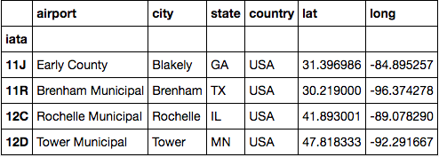

Format:
Question: ...  
Type: Multiple Choice (Single Correct Answer),  Multiple Choice (Multiple Correct Answers), Free Response (Text Answers, Code Expression)
Answer: ...  
Choices: ...  

# Lesson 1

# Lesson 2

- Question: How can a length 15 numpy array of 0's be created?
    - Type: Multiple Choice (Single Correct Answer)
    - Answer: np.zeros(15)
    - Choices: np.zero(15); np.zeros(15); zeros.np(15); np.zeros(14)

- Question: What would be the output of np.arange(0,10,2)
    - Type: Multiple Choice (Single Correct Answer)
    - Answer: array([0, 2, 4, 6, 8])
    - Choices: [0, 2, 4, 6, 8]; array([0, 2, 4, 6, 8,10]); [0, 2, 4, 6, 10]; array([0, 2, 4, 6, 8])

- Question: If a numpy matrix called "my_matrix" has 10 rows and 10 columns, what would the output of "my_matrix.size" be?
    - Type: Multiple Choice (Single Correct Answer)
    - Answer: 100
    - Choices: 10; 20; 100; (10,10)

- Question: If a numpy matrix called "my_matrix" has 10 rows and 10 columns, what would the output of "my_matrix.shape" be?
    - Type: Multiple Choice (Single Correct Answer)
    - Answer: (10,10)
    - Choices: 100; (10,10); (100,100); 10

- Question: How would you import the numpy library?
    - Type: Multiple Choice (Single Correct Answer) or Free Response Code Expression
    - Answer: import numpy as np
    - Choices: import numpy as np; library numpy; import numpy library as np; numpy import

- Question: What would be the output of "np.max(np.array([10,20,30])"
    - Type: Multiple Choice (Single Correct Answer)
    - Answer: 30
    - Choices: [10,20,30]; np.array([30]); 30; [30]

- Question: What would be the output of "np.array([1,2,3]) > 2" ?
    - Type: Multiple Choice (Single Correct Answer)
    - Answer: array([False, False, True])
    - Choices: array([False, False, True]); [False, False, True]; True; False

- Question: How could you change the first value of a numpy array called "my_array" to 5?
    - Type: Multiple Choice (Single Correct Answer)  or Free Response Code Expression
    - Answer: my_array[0] = 5
    - Choices: my_array = 5; my_array[1] = 5; my_array[0] = 5; my_array[5] = 5

# Lesson 3

- Question: Given N data points, $$x_{i}$$ for $$i = 1,...,n$$ what does $$\frac{\sum_{i=1}^{N} x_{i}}{N}$$ represent?
    - Type: Multiple Choice (Single Correct Answer)  
    - Answer: Mean
    - Choices: Mean; Median; Mode; Variance

- Question: Given N data points, $$x_{i}$$ for $$i = 1,...,n$$ what represents their sample mean?
    - Type: Multiple Choice (Single Correct Answer)  
    - Answer: $$\bar{x}$$
    - Choices: $$\bar{\mu}$$; $$\bar{\sigma}$$; $$\hat{x}$$; $$\bar{x}$$

- Question: Given N data points, $$x_{i}$$ for $$i = 1,...,n$$ what does $$\frac{\sum_{i=1}^{N} (x_{i} - \bar{x})^{2}}{N}$$ represent?
    - Type: Multiple Choice (Single Correct Answer)  
    - Answer: Variance
    - Choices: Mean; Median; Mode; Variance

- Question: What variable is typically used to represent the sample standard deviation?
    - Type: Multiple Choice (Single Correct Answer)  
    - Answer: s
    - Choices: s; $$s^{2}$$; $$\sigma$$; $$\sigma^{2}$$

- Question: How do most Python modules calculate the median for an even number of data points?
    - Type: Multiple Choice (Single Correct Answer)  
    - Answer: average the two middle values
    - Choices: Report an error; Take the lower of the two middle values; Average the two middle values; Take the higher of the two middle values

- Question: Which of the following are typically thought of as measures of variability or dispersion?
    - Type: Multiple Choice (Multiple Correct Answers)  
    - Answer: Variance, Standard Deviation
    - Choices: Variance; Median; Mode; Standard Deviation

# Lesson 4

- Question: We used pandas library to read in a dataset and store it in a variable called df. How do I display the first 5 lines?
  - Type: Multiple choice (Multiple Correct Answers)
  - Answer: df.head(5); df.head()
  - Choices: df.head(5); df.head(); df.tail(); dfa.head(); df.tail(5)
- Question: I've stored data from airports inside of a dataframe called dfa. How do I display the data types of each colmn in dfa?
  - Type: Multiple choice (Single correct answer)
  - Answer: dfa.dtypes
  - Choices:  dfa.dtypes; dfa.columns; dfa.head(); df.tail()
- Question: How do I display a summary of a dataframe called dfa?
  - Type: Multiple choice (Single correct answer)
  - Answer: dfa.describe()
  - Choices:  dfa.describe(); dfa.describe; dfa.summary(); dfa.head(); dfa.tail()
- Question:How do I grab row 88-92 of a dataframe called dfa that has 100 rows of data?
  - Type: Multiple choice (Single correct Answer)
  - Answer: dfa[88:92]
  - Choices: dfa[88:92]; dfa:82:102; dfa(88:92); dfa[88-92]
- Question: How do I grab rows with index 11J, 12C, and 12D from this dataframe dfa? 
  - Type:Multiple choice (Single correct answer)
  - Answer: dfa.loc[['11J', '12C', '12D']]
  - Choices: dfa.loc[['11J', '12C', '12D']]; dfa.loc['11J', '12C', '12D']; dfa.loc('11J', '12C', '12D'); dfa.loc[[11J, 12C, 12D]]
- Question: I have loaded data about tips into a dataframe named df. How do I group this dataframe by time? 
  - Type: Multiple choice (Single correct answer)
  - Answer: df.groupby('time')
  - Choices: df.groupby('time'); df.group('time');df.groupby(time);df.groupby(column=time)
- Question: How do you randomly select 50 rows from a dataframe called df?
  - Type: Multiple Choice (Single correct answer)
  - Answer: df.sample(50)
  - Choices: df.head(50); df.sample(50); df.tail(50); df.sample()
